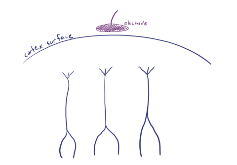

## EEG measures summated activity

Neurons communicate through a combination of chemical neurotransmitters and electrical gradients, and electroencephalography, or EEG, detects those electrical gradients to provide insight into the activity of the brain. Realize, however, that any single neuron's electrical activity is far too miniscule to be detected by scalp EEG, and thus what we see on EEG is actually a summation of many neurons' activity; in fact, we require at least 6 square centimeters of synchronized cortical activity for anything to be detected on scalp EEG. Here we'll review the basics of neural signals and how those are converted to the tracings you'll read on EEG. [^1]

## Resting & action potentials

Neuronal membranes have a multitude of ion channels that maintain order and control signals in and around themselves. Perhaps the most important of these is the sodium potassium channel, which maintains the basal resting potential of the neuron by pumping three Na+ ions out of the cell for every two K+ ions it pumps into the cell. Because there are relatively more positive ions outside the cell, this creates an electrical gradient with a **resting potential inside the cell of -70mV.**

Signals move through a neuron via an **action potential** , in which a region of the neuron undergoes **depolarization** via opening of the Na/K channels leading to a rush of Na+ into the cell, with subsequent loss of the basal resting potential (so the usual -70mV may go, for example, to +20mV). Pertinent for EEG is that this depolarization also leads to a **relatively negative voltage outside the cell**.

Contrary to depolarization, **hyperpolarization** occurs when there is exaggerated movement of K+ out of the cell to cause the resting intracellular voltage to become *more* negative, say from -70mV to -100mV. Pertinent for EEG in this case is that hyper polarization leads to a **relatively positive voltage outside the cell** . Most commonly, hyper polarization occurs briefly and immediately after a depolarization as part of the refractory period in which the usual membrane potential is restored; however, neurotransmitters also play a role in causing these dual mechanisms.

While action potentials transmit signals through a single neuron, neurons communicate with each other at their synapses via neurotransmitters. Excitatory neurotransmitters such as **glutamate** bind to postsynaptic receptors and cause an **excitatory postsynaptic potential (EPSP)** to promote subsequent depolarization and propagation of a signal through a network of neurons. Inhibitory neurotransmitters, such as **GABA** , cause an **inhibitory postsynaptic potential (IPSP)** to promote hyperpolarization and cessation of further signal propagation through a network.

## The creation of eeg signal

Recall that depolarization leads to an extracellular negative voltage, while hyperpolarization leads to an extracellular positive voltage. Either way, this **extracellular voltage is picked up by EEG electrodes** , which see not a single depolarization but rather a summation of the voltages from many EPSPs and IPSPs over a broad area of cortex arising from pyramidal neurons.

Unfortunately, the EPSPs and IPSPs, and their respective voltage changes, are not the full picture. This is to say, not every EPSP will be seen as a negative signal on EEG despite the coinciding extracellular negative potential. Remember that the brain is more than just a bunch of neurons--it is a very organized bunch of neurons, and that organization affects what portion of a neuron's activity is seen by the EEG electrode.

Specifically, cortical neurons are arranged in columns perpendicular to the cortex surface, and depolarizations at the surface and deep levels of the columns cause different EEG signals. With surface level depolarizations, the extracellular space closest to the EEG electrode is negatively charged, and that is simply what the EEG sees.

However, with deeper depolarizations, the extracellular area immediately around the area of depolarization is negative as expected, but that means the extracellular space closer to the surface is relatively positively charged, and that positive charge is what the EEG electrode sees in this case.

So, **superficial depolarizations lead to negative EEG signals** while **deep depolarizations lead to positive EEG signals** . The opposite is true for hyperpolarizations, which behave the same but with inverted polarity: deep hyperpolarizations cause a negative scalp EEG signal, and surface hyperpolarizations cause a positive scalp EEG signal. In other words, for EEG signal **surface EPSPs and deep IPSPs look the same** , and **deep EPSPs and surface IPSPs look the same**.

Once a potential is seen by an EEG electrode, its converted into the waveforms you see on the EEG itself. The exact appearance of the waves on the tracing depends on the chosen montage, but there is one universal albeit initially counterintuitive rule: **negative potentials are upgoing waves** , and **positive potentials are downgoing waves** .

## Characteristics of EEG signal

In general, biosignals are '3N' – Nonstationary, Nonlinear, Noisy

### Stationary

Nonstationarity means that signal's statistical characteristics change with time. The brain activity is essentially nonstationary. Quasi-stationary segments in EEG have duration about 0.25 sec. The basic source of the observed nonstationarity in EEG signal is not due to the casual influences of the external stimuli on the brain mechanisms but rather it is a reflection of switching of the inherent metastable states of neural assemblies during brain functioning. EEG-signal recorded from a scalp electrode is influenced by different deeper brain structures, each 'transmitting' with different and changeable intensity; so, in a fraction of a second the main source of the registered signal often moves from one brain structures to another. And if source of a signal changes with time then the signal is obviously nonstationary. Nonstationarity arises also because of different time scales involved in the dynamical process – dynamical parameters are sensitive to the time scales and hence in the study of brain one must identify all relevant time scales involved in the process to get an insight in the working of brain. It is extremely important that fractal methods easily detect nonstationarities in the analyzed signals, nonstationarities that are not easily detectable by linear methods like FFT. Nonstationarities in EEG are also due to pathological changes, for example epileptic seizures, or to changes of the physiological state, for example passing from one sleep stage to another. [^2]

## References

[^1]: "Basic electrophysiology" *https://www.learningeeg.com/*.
    
[^2]: "Everything you wanted to ask about EEG but were afraid to get the right answer." *Wlodzimierz Klonowski*, 2009.
