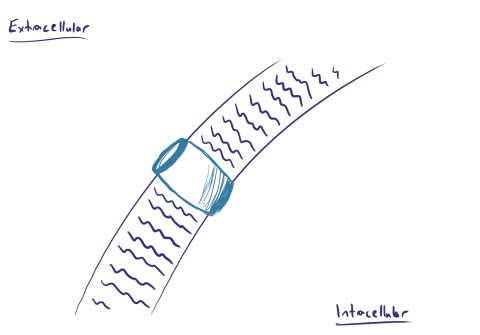

## EEG measures summated activity
Neurons communicate through a combination of chemical neurotransmitters and electrical gradients, and electroencephalography, or EEG, detects those electrical gradients to provide insight into the activity of the brain. Realize, however, that any single neuron's electrical activity is far too miniscule to be detected by scalp EEG, and thus what we see on EEG is actually a summation of many neurons' activity; in fact, we require at least 6 square centimeters of synchronized cortical activity for anything to be detected on scalp EEG. Here we'll review the basics of neural signals and how those are converted to the tracings you'll read on EEG.

## Resting & action potentials
Neuronal membranes have a multitude of ion channels that maintain order and control signals in and around themselves. Perhaps the most important of these is the sodium potassium channel, which maintains the basal resting potential of the neuron by pumping three Na+ ions out of the cell for every two K+ ions it pumps into the cell. Because there are relatively more positive ions outside the cell, this creates an electrical gradient with a **resting potential inside the cell of -70mV.**

