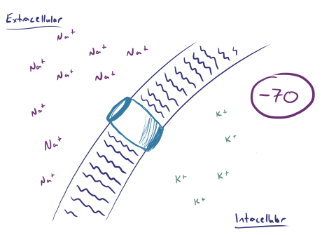
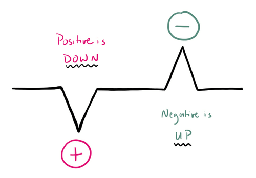

## ĐO LƯỜNG EEG HOẠT ĐỘNG TỔNG HỢP

Các tế bào thần kinh giao tiếp thông qua sự kết hợp của các chất dẫn truyền thần kinh hóa học và độ dốc điện, đồng thời điện não đồ, hay EEG, phát hiện các độ dốc điện đó để cung cấp cái nhìn sâu sắc về hoạt động của não. Tuy nhiên, hãy nhận ra rằng hoạt động điện của bất kỳ tế bào thần kinh nào cũng quá nhỏ để có thể được phát hiện bằng điện não đồ da đầu, và do đó những gì chúng ta thấy trên điện não đồ thực sự là sự tổng hợp hoạt động của nhiều tế bào thần kinh; trên thực tế, chúng tôi cần ít nhất 6 cm vuông hoạt động đồng bộ của vỏ não để có thể phát hiện mọi thứ trên điện não đồ da đầu. Ở đây chúng ta sẽ xem xét những điều cơ bản về tín hiệu thần kinh và cách chúng được chuyển đổi thành các dấu vết mà bạn sẽ đọc trên điện não đồ. [^1]

## Điện thế nghỉ & hoạt động

Màng tế bào thần kinh có rất nhiều kênh ion giúp duy trì trật tự và kiểm soát các tín hiệu trong và xung quanh chúng. Có lẽ quan trọng nhất trong số này là kênh natri-kali, kênh này duy trì điện thế nghỉ cơ bản của tế bào thần kinh bằng cách bơm ba ion Na+ ra khỏi tế bào cho mỗi hai ion K+ được bơm vào tế bào. Vì có nhiều ion dương hơn bên ngoài tế bào, điều này tạo ra **một gradient điện với điện thế nghỉ bên trong tế bào là -70mV.**

Tín hiệu di chuyển qua một tế bào thần kinh thông qua **điện thế hoạt động**, trong đó một vùng của tế bào thần kinh trải qua quá trình **khử cực** thông qua việc mở các kênh Na/K dẫn đến sự tràn vào của Na+ vào trong tế bào, với sự mất điện thế nghỉ cơ bản (vì vậy điện thế -70mV thông thường có thể tăng lên, ví dụ, +20mV). Đối với EEG, quá trình khử cực này cũng dẫn đến **điện áp tương đối âm bên ngoài tế bào**.

Ngược lại với quá trình khử cực, quá trình **siêu phân cực** xảy ra khi có sự di chuyển quá mức của K+ ra khỏi tế bào khiến điện áp nội bào lúc nghỉ trở nên âm hơn, chẳng hạn từ -70mV đến -100mV. Điều quan trọng đối với EEG trong trường hợp này là sự siêu phân cực dẫn đến điện áp tương đối dương bên ngoài tế bào. Thông thường nhất, quá trình siêu phân cực xảy ra trong thời gian ngắn và ngay sau quá trình khử cực như một phần của giai đoạn trơ trong đó điện thế màng thông thường được phục hồi; tuy nhiên, chất dẫn truyền thần kinh cũng đóng vai trò gây ra các cơ chế kép này.Ngược lại với sự khử cực, sự tăng **phân cực** xảy ra khi có sự di chuyển quá mức của K+ ra khỏi tế bào khiến điện thế nội bào nghỉ ngơi trở nên âm hơn, chẳng hạn từ -70mV đến -100mV. Liên quan đến EEG trong trường hợp này là sự tăng phân cực dẫn **đến điện thế tương đối dương bên ngoài tế bào**. Phổ biến nhất, sự tăng phân cực xảy ra trong thời gian ngắn và ngay sau khi khử cực như một phần của giai đoạn chịu lửa trong đó điện thế màng thông thường được phục hồi; tuy nhiên, các chất dẫn truyền thần kinh cũng đóng vai trò gây ra các cơ chế kép này.

Trong khi các điện thế hoạt động truyền tín hiệu qua một tế bào thần kinh, các tế bào thần kinh giao tiếp với nhau tại các khớp thần kinh thông qua các chất dẫn truyền thần kinh. Các chất dẫn truyền thần kinh kích thích như **glutamate** liên kết với các thụ thể sau khớp thần kinh và gây ra điện thế **kích thích sau khớp thần kinh (EPSP)** để thúc đẩy quá trình khử cực và truyền tín hiệu tiếp theo qua mạng lưới tế bào thần kinh. Các chất dẫn truyền thần kinh ức chế, chẳng hạn như **GABA**, tạo ra điện thế **ức chế sau khớp thần kinh (IPSP)** để thúc đẩy quá trình siêu phân cực và ngừng truyền tín hiệu tiếp theo qua mạng.

## Sự tạo ra tín hiệu EEG

Hãy nhớ lại rằng quá trình khử cực dẫn đến điện áp âm ngoại bào, trong khi quá trình siêu phân cực dẫn đến điện áp dương ngoại bào. Dù bằng cách nào, **điện áp ngoại bào này được thu bởi các điện cực EEG,** chúng không nhìn thấy sự khử cực đơn lẻ mà là tổng các điện áp từ nhiều EPSP và IPSP trên một vùng vỏ não rộng phát sinh từ các tế bào thần kinh hình chóp.

Thật không may, EPSP và IPSP cũng như những thay đổi điện áp tương ứng của chúng không phải là bức tranh đầy đủ. Điều này có nghĩa là, không phải mọi EPSP sẽ được coi là tín hiệu tiêu cực trên điện não đồ mặc dù điện thế âm ngoại bào trùng khớp. Hãy nhớ rằng bộ não không chỉ là một tập hợp các tế bào thần kinh - nó là một tập hợp các tế bào thần kinh có tổ chức rất cao và tổ chức đó ảnh hưởng đến phần hoạt động của tế bào thần kinh được điện cực EEG nhìn thấy.

Cụ thể, các tế bào thần kinh vỏ não được sắp xếp theo các cột vuông góc với bề mặt vỏ não, và sự khử cực ở bề mặt và các mức sâu của các cột gây ra các tín hiệu EEG khác nhau. Với sự khử cực ở mức bề mặt, không gian ngoại bào gần nhất với điện cực EEG sẽ tích điện âm, và đó chính xác là những gì EEG nhìn thấy.

Tuy nhiên, với quá trình khử cực sâu hơn, vùng ngoại bào ngay xung quanh vùng khử cực là âm như mong đợi, nhưng điều đó có nghĩa là không gian ngoại bào gần bề mặt hơn mang điện tích dương và điện tích dương đó là điện cực EEG nhìn thấy trong trường hợp này.

Vì vậy, **khử cực bề ngoài dẫn đến tín hiệu EEG âm** trong khi **khử cực sâu dẫn đến tín hiệu EEG dương**. Điều ngược lại cũng đúng đối với các siêu phân cực, hoạt động giống nhau nhưng có cực phân cực ngược: siêu phân cực sâu gây ra tín hiệu EEG da đầu âm và siêu phân cực bề mặt gây ra tín hiệu EEG da đầu dương. Nói cách khác, đối với EPSP bề mặt tín hiệu **EEG và IPSP sâu trông giống nhau**, còn **EPSP sâu và IPSP bề mặt trông giống nhau**.

Khi điện cực EEG nhìn thấy điện thế, nó sẽ chuyển đổi thành dạng sóng mà bạn nhìn thấy trên chính điện cực EEG. Sự xuất hiện chính xác của các sóng trên đường đồ thị phụ thuộc vào cách dựng phim đã chọn, nhưng có một quy tắc phổ quát mặc dù ban đầu phản trực giác: **điện thế âm là sóng đi lên** và **điện thế dương là sóng đi xuống**.

## Characteristics of EEG signal

In general, biosignals are '3N' – Nonstationary, Nonlinear, Noisy

### Stationary

Nonstationarity means that signal's statistical characteristics change with time. The brain activity is essentially nonstationary. Quasi-stationary segments in EEG have duration about 0.25 sec. The basic source of the observed nonstationarity in EEG signal is not due to the casual influences of the external stimuli on the brain mechanisms but rather it is a reflection of switching of the inherent metastable states of neural assemblies during brain functioning. EEG-signal recorded from a scalp electrode is influenced by different deeper brain structures, each 'transmitting' with different and changeable intensity; so, in a fraction of a second the main source of the registered signal often moves from one brain structures to another. And if source of a signal changes with time then the signal is obviously nonstationary. Nonstationarity arises also because of different time scales involved in the dynamical process – dynamical parameters are sensitive to the time scales and hence in the study of brain one must identify all relevant time scales involved in the process to get an insight in the working of brain. It is extremely important that fractal methods easily detect nonstationarities in the analyzed signals, nonstationarities that are not easily detectable by linear methods like FFT. Nonstationarities in EEG are also due to pathological changes, for example epileptic seizures, or to changes of the physiological state, for example passing from one sleep stage to another. [^2]

## References

[^1]: "Basic electrophysiology" *https://www.learningeeg.com/*.
    
[^2]: "Everything you wanted to ask about EEG but were afraid to get the right answer." *Wlodzimierz Klonowski*, 2009.
